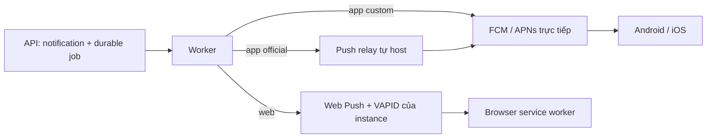

# Push notification cho hệ thống self-host

Tài liệu này là nguồn chuẩn để cấu hình push cho mobile và web. Mặc định toàn
bộ push ngoài hệ thống đều tắt: notification center, WebSocket và sync cursor
vẫn hoạt động, nhưng hệ điều hành không thể đánh thức client đã đóng.

## Kiến trúc



- App official dùng relay do đơn vị phát hành app vận hành. Firebase service
  account và APNs `.p8` không được phát tán tới VPS khách hàng.
- App custom-brand có thể dùng FCM/APNs riêng và gửi trực tiếp.
- Web Push dùng một cặp VAPID riêng cho từng domain self-host. Private key chỉ
  cần ở worker; API chỉ công bố public key.
- Push là tín hiệu đánh thức, không phải nguồn dữ liệu. Client luôn catch-up qua
  sync cursor sau khi reconnect.

APNs sender trong source chỉ dùng PushKit VoIP token cho `call_invite`. Tin nhắn
thường không được gửi qua APNs VoIP.

PostgreSQL phải giữ active provider token/Web Push subscription để gửi nền. API
không echo các giá trị này, nhưng quyền đọc database hoặc backup vẫn là quyền
truy cập dữ liệu nhạy cảm; hãy mã hóa backup và giới hạn operator có quyền đọc.

## Chọn chế độ mobile

### Relay cho app official

Trên mỗi instance khách hàng:

```dotenv
PUSH_RELAY_URL=https://relay.publisher.example/v1/deliveries
PUSH_RELAY_TOKEN=<token-ngau-nhien-rieng-cua-instance>
PUSH_RELAY_INSTANCE_ID=<publisher-id>
```

Ba giá trị phải được điền cùng nhau. Production chỉ nhận relay URL HTTPS không
có credential trong URL. Không cấu hình relay client đồng thời với FCM/APNs
trực tiếp; backend sẽ fail-fast để tránh gửi trùng hoặc route không rõ ràng.

### FCM/APNs trực tiếp cho app custom

```dotenv
FIREBASE_PROJECT_ID=<project-id>
FIREBASE_SERVICE_ACCOUNT_JSON_BASE64=<base64-service-account-json>

APNS_KEY_ID=<key-id>
APNS_TEAM_ID=<team-id>
APNS_BUNDLE_ID=com.company.chat
APNS_PRIVATE_KEY_BASE64=<base64-file-p8>
APNS_SANDBOX=false
```

Project, package name, bundle ID, entitlement và provisioning profile phải khớp
binary. Có thể dùng biến `*_FILE` nếu secret được mount read-only vào worker.

## Vận hành relay chính thức, không phụ thuộc SaaS

Repository có binary `push-relay`, OpenAPI riêng tại
`backend/api/openapi/push-relay.yaml`, queue PostgreSQL và compose profile opt-in.
Một publisher sở hữu credential của binary official có thể tự vận hành service
này; customer không cần gửi dữ liệu chat tới dịch vụ SaaS của repository.

Trên host relay, để trống `PUSH_RELAY_URL/TOKEN/INSTANCE_ID`, cấu hình ít nhất
một provider trực tiếp và bật:

```dotenv
PUSH_RELAY_SERVER_ENABLED=true
PUSH_RELAY_PUBLISHERS=customer-a=<random-32+-chars>;customer-b=<random-32+-chars>
PUSH_RELAY_MAX_BODY_BYTES=32768
PUSH_RELAY_RATE_LIMIT_PER_MINUTE=240
PUSH_RELAY_RATE_LIMIT_BURST=60
PUSH_RELAY_WORKER_CONCURRENCY=4
PUSH_RELAY_POLL_INTERVAL=1s
```

Compose dùng `.env` ở đây để **nội suy allowlist**, không inject toàn bộ file vào
process relay. Container `push-relay` chỉ nhận app environment/logging/OTel,
database, `PUSH_RELAY_SERVER_*`, credential FCM/APNs và `SERVICE_NAME`; nó không nhận JWT,
webhook, bot/OIDC, TURN, storage, Redis/RabbitMQ, Web Push hay credential relay
client. Container migration cũng chỉ nhận app/logging và database. Không thêm
lại `env_file: .env` cho hai service này.

Hai biến provider `*_FILE` chỉ dùng được khi operator tạo Compose override/secret
mount read-only đúng path trong container. Với Compose base, dùng giá trị
`*_JSON_BASE64`/`APNS_PRIVATE_KEY_BASE64` hoặc secret manager phù hợp; không mount
cả thư mục deploy chỉ để đưa key vào relay.

Sau đó:

```sh
cd deploy/self-hosted
docker compose --env-file .env -f compose.yml --profile push-relay up -d --build
docker compose --env-file .env -f compose.yml --profile push-relay exec -T \
  push-relay wget -qO- http://localhost:8090/ready
```

Caddy chỉ chuyển hai route publisher đã xác thực
`/push-relay/v1/deliveries` và `/push-relay/v1/deliveries/*` tới relay. `/health`,
`/ready` và `/metrics` của relay chỉ có trong backend network; không proxy chúng
ra Internet. Chỉ cấp một token mạnh cho mỗi publisher ID; không dùng lại token giữa các customer. Khi xoay token, thêm token mới trên
relay, cập nhật customer worker, restart worker rồi mới thu hồi token cũ.

Relay thực hiện:

- Bearer auth ràng buộc publisher ID;
- `Idempotency-Key` bắt buộc; reuse cùng nội dung trả lại job cũ, reuse khác nội
  dung trả `409`;
- giới hạn body, allow-list payload, rate/burst theo publisher;
- phản hồi `425/429` được customer worker xem là deferred, không tiêu retry
  budget local; `Retry-After` hợp lệ được áp dụng trong khoảng an toàn 5 giây–5
  phút và raw header không được lưu;
- queue durable, `FOR UPDATE SKIP LOCKED`, lease reclaim sau crash, tối đa tám
  lần gửi với exponential backoff;
- trạng thái `pending/processing/retry/sent/dead`, health và readiness riêng;
- xóa device token/payload khỏi queue khi job `sent/dead`, dọn metadata kết thúc
  sau retention mặc định bảy ngày;
- tự chuyển lease `processing` hết hạn ở lần thử cuối sang `dead` và xóa
  token/payload, tránh job kẹt vĩnh viễn sau crash;
- log chỉ chứa request/job/publisher/provider metadata, không log Bearer token,
  device token hoặc payload.

Prometheus trong profile `observability` scrape `push-relay:8090/metrics` trực
tiếp qua backend network. Endpoint chỉ xuất aggregate queue theo status,
`sent/dead` 24 giờ, tuổi job cũ nhất và delivery rate; không có publisher ID,
device token, payload hoặc provider error. Grafana và Alertmanager có panel/rule
riêng cho queue stalled, dead-letter, delivery rate thấp và lỗi thu metrics.

`202 Accepted` nghĩa là relay đã lưu durable, không có nghĩa provider đã giao tới
thiết bị. Theo dõi status bằng:

```http
GET /v1/deliveries/{job_id}
Authorization: Bearer <publisher-token>
X-Push-Relay-Publisher: customer-a
```

Không đưa raw token, `.env`, service account, `.p8` hoặc payload vào issue/log.

## Web Push/VAPID theo từng instance

### 1. Tạo key một lần

```sh
cd deploy/self-hosted
docker compose --env-file .env -f compose.yml run --rm api vapid-keygen
```

Chép hai dòng kết quả vào `.env`, đặt subject liên hệ hợp lệ rồi bật feature:

```dotenv
WEB_PUSH_ENABLED=true
WEB_PUSH_VAPID_PUBLIC_KEY=<public-url-safe-base64>
WEB_PUSH_VAPID_PRIVATE_KEY=<private-url-safe-base64>
WEB_PUSH_VAPID_SUBJECT=mailto:admin@example.com
WEB_PUSH_TTL_SECONDS=300
WEB_PUSH_MAX_SUBSCRIPTIONS_PER_USER=10
```

Backup cặp key cùng `.env`. Không commit private key. Compose chủ động xóa biến
private key khỏi process API; worker mới dùng key để ký VAPID. Xoay VAPID key sẽ
làm subscription hiện tại không còn dùng được, vì vậy chỉ xoay khi cần và yêu
cầu browser đăng ký lại.

Restart các service liên quan:

```sh
docker compose --env-file .env -f compose.yml up -d --build --force-recreate api worker web
```

Web Push cần secure context (HTTPS; localhost là ngoại lệ dành cho development).

### 2. Contract browser

```text
GET    /api/v1/notifications/web-push/config
POST   /api/v1/notifications/web-push/subscriptions
DELETE /api/v1/notifications/web-push/subscriptions/{subscription_id}
```

`GET config` luôn fail-safe: khi feature tắt hoặc public key không có, API trả
`enabled:false` và không trả key. Endpoint đăng ký yêu cầu Bearer auth, active
zone/workspace membership và body:

```json
{
  "workspace_id": "<uuid>",
  "endpoint": "https://push-service.example/subscription/...",
  "expiration_time": "2026-12-31T00:00:00Z",
  "keys": {
    "p256dh": "<browser-key>",
    "auth": "<browser-secret>"
  }
}
```

API không echo endpoint/key. Endpoint được unique bằng SHA-256; đăng ký lại từ
cùng browser cho đúng instance/zone và user chỉ refresh credential hiện có.
Endpoint đang thuộc tài khoản khác trả `409` và không được chuyển ownership;
frontend phải unsubscribe local trước khi tạo subscription cho tài khoản mới.
Subscription cũ vượt quota bị revoke.

Worker mã hóa payload Web Push, giới hạn preview, tự tạo deep link cùng origin và
không tin `deep_link` tùy ý từ payload. `404/410` từ push service làm subscription
bị revoke; lỗi tạm thời đi qua retry/ledger của notification job.

### 3. Consent và service worker

- Không gọi `Notification.requestPermission()` khi load trang.
- Chỉ hiển thị nút opt-in sau khi user đã đăng nhập và browser/config hỗ trợ.
- Prompt permission chỉ được gọi trực tiếp từ thao tác click/tap của user.
- Service worker deduplicate theo event ID/tag và chỉ điều hướng URL cùng origin
  thuộc `/chat/...` khi click notification.
- Khi user tắt notification, gọi API revoke và `PushSubscription.unsubscribe()`.
- Nếu permission là `denied`, hướng dẫn user mở browser/site settings; JavaScript
  không thể tự bật lại quyền.

Frontend đăng ký `/sw.js` với scope `/` chỉ sau thao tác opt-in. Mỗi
`PushSubscription` là account-wide trong phạm vi instance/zone và user đã xác thực,
không thuộc riêng một workspace. `workspace_id` trong request đăng ký chỉ là bằng
chứng authorization: API dùng nó để xác nhận membership tại thời điểm đăng ký,
không dùng nó làm ownership hay phạm vi của subscription. Notification preferences
được áp dụng khi tạo job; ngay trước khi giao, backend kiểm tra lại membership hiện
tại của workspace đích để không gửi sau khi user đã rời workspace. Chuyển workspace không chuyển ownership, không
đăng ký lại consent và không yêu cầu thao tác chuyển thủ công.
Logout/account switch revoke subscription nếu còn auth, luôn unsubscribe local và
xóa ownership record để tài khoản sau không kế thừa consent của tài khoản trước.

## Quan sát queue an toàn

Trong Admin Panel, mở **Push** để xem queue depth, tuổi job cũ nhất, số `sent/dead`
24 giờ, delivery rate, provider và dead-letter đã redacted. Trang tự refresh 15
giây; replay cần `notification.manage` và cùng một dead-letter không tạo nhiều
replay job. Job `skipped` nghĩa là không có destination đủ điều kiện và không được
tính vào delivery rate. “Delivered” ở đây nghĩa là provider/relay đã chấp nhận destination,
không phải biên nhận người dùng đã nhìn thấy notification (FCM/APNs/Web Push
không cung cấp một receipt thống nhất như vậy).

```sh
cd deploy/self-hosted
docker compose --env-file .env -f compose.yml exec -T postgres sh -c \
  'psql -U "$POSTGRES_USER" -d "$POSTGRES_DB" -c \
  "SELECT status, count(*), min(created_at) AS oldest
   FROM notification_jobs GROUP BY status ORDER BY status"'

docker compose --env-file .env -f compose.yml exec -T postgres sh -c \
  'psql -U "$POSTGRES_USER" -d "$POSTGRES_DB" -c \
  "SELECT status, count(*) FROM push_relay_jobs GROUP BY status ORDER BY status"'
```

Các câu lệnh không select destination token, endpoint, key hoặc payload.

Migration `000034` cài constraint mới ở trạng thái `NOT VALID`, `000036` xác thực
online sau khi lock metadata đã được giải phóng, và `000037` tạo index ngoài
transaction. Nếu tiến trình bị ngắt ở `000037`, chạy lại lệnh migrate; migration
sẽ dọn index `INVALID` còn sót rồi tạo lại bằng `CONCURRENTLY`.
Mỗi lần chờ lock bị giới hạn 30 giây và mỗi statement bị giới hạn 30 phút; nếu
hết hạn, tìm long-running transaction, xử lý nguyên nhân rồi chạy lại migration.

Rollback `000034` cố ý từ chối chạy nếu đã có job `skipped`, vì schema cũ không
có trạng thái tương đương và mọi phép đổi sang `sent`/`dead` đều làm sai dữ liệu
vận hành. Khi đó hãy restore snapshot an toàn tạo trước migration, hoặc xử lý các
row này bằng một kế hoạch dữ liệu được phê duyệt rồi mới rollback.

## Checklist kiểm thử thật

1. Chạy đầy đủ migration `000033`–`000037`; `000037` tạo index online bằng
   `CREATE INDEX CONCURRENTLY`. Sau đó kiểm tra `/ready` của API và relay (nếu bật).
2. Android/iPhone thật: foreground, background, force-stop/lock screen, deep link,
   refresh token, logout/revoke và cuộc gọi đến.
3. Chrome, Edge, Firefox và Safari: opt-in, reload, đóng tab, click deep link,
   revoke, permission denied và subscription `404/410`.
4. Gửi lại cùng idempotency key và xác nhận relay chỉ có một job.
5. Tắt provider/network, xác nhận `retry`; khôi phục rồi xác nhận `sent`.
6. Restart relay giữa lúc `processing`, xác nhận lease được reclaim.
7. Kiểm tra log không chứa một phần bất kỳ của Bearer/device/subscription token.
8. Tắt `WEB_PUSH_ENABLED` và `PUSH_RELAY_SERVER_ENABLED`, xác nhận stack mặc định
   vẫn hoạt động và browser không tự xin quyền.

Simulator và unit test không chứng minh được delivery từ Apple/Google/browser
push service. Credential thật, TLS public, chính sách tiết kiệm pin và quyền của
từng browser/OS vẫn phải được kiểm thử trên thiết bị thật trước production.
